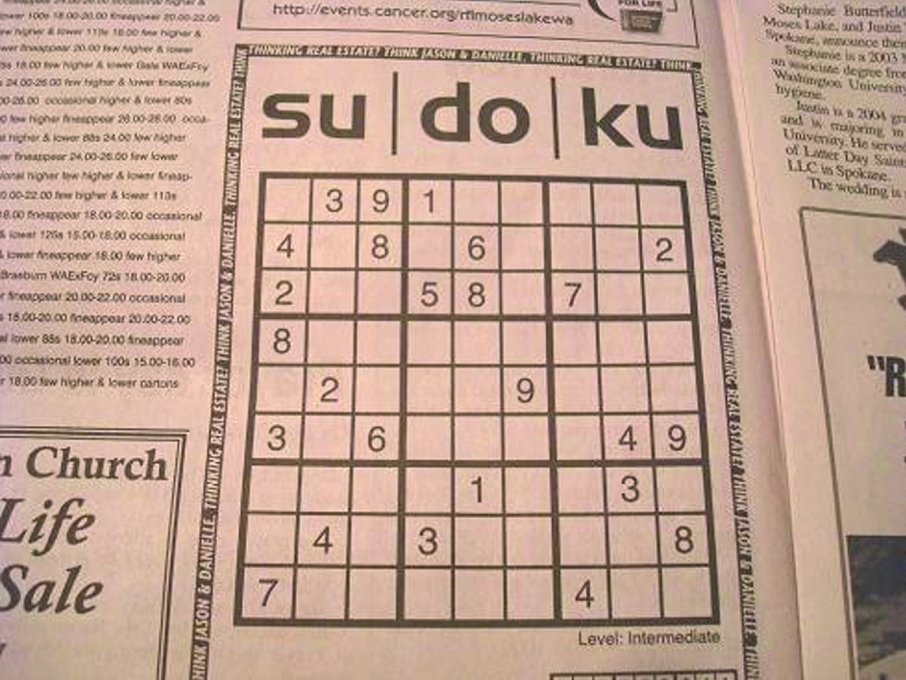

## Sudoku Detector
- Detect sudoku and transform to flat image using *imutils.perspective*
```shell
usage: sudoku_detector.py [-h] [--input INPUT] [--output OUTPUT]
```
> 


## Live Sudoku Detector [^1]
- Real-time Sudoku detector
```shell
usage: live_sudoku_detector.py [-h] [--input INPUT] [--output OUTPUT]
```
> 
